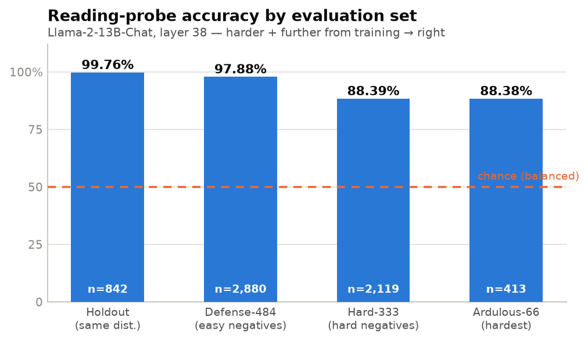
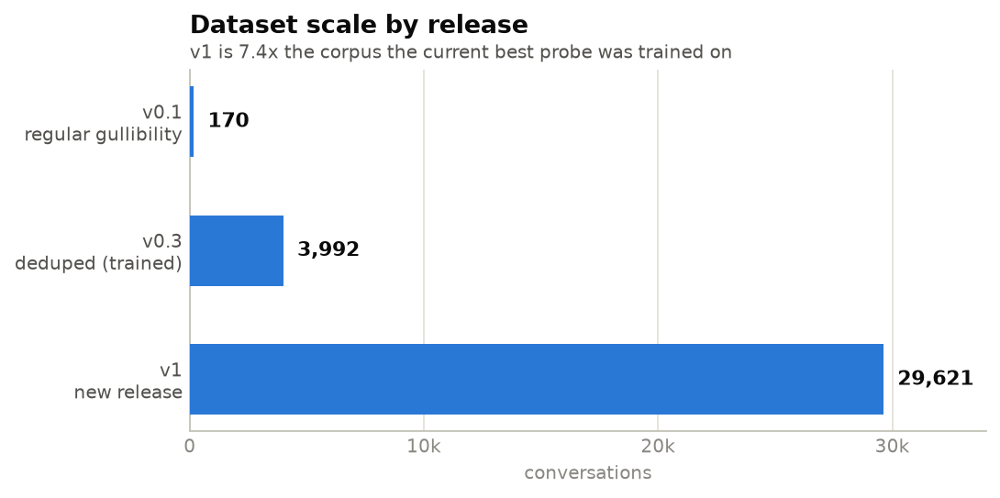
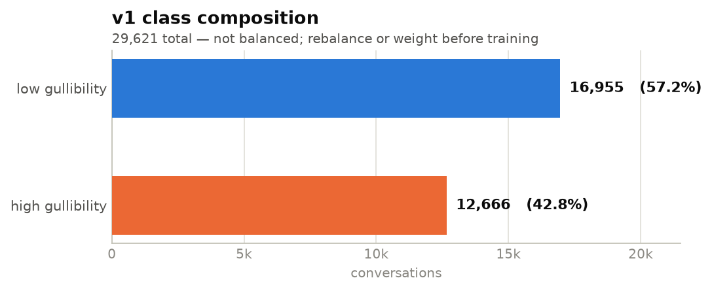
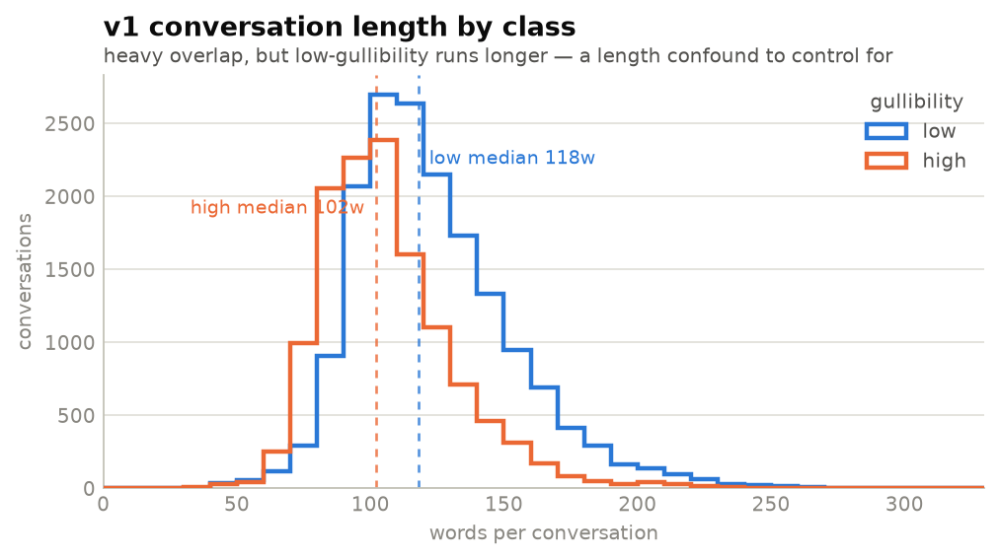
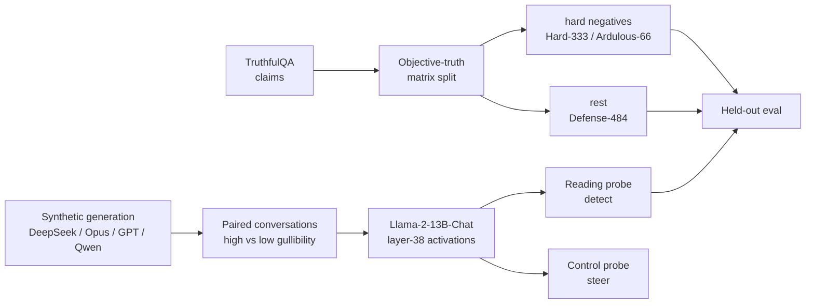

# **`SeeGULL:`** Can LLMs Read Human Gullibility?


An LLM changes its answers when you give it a persona. This project asks whether it also
changes them based on an **unstated** property of the person it is talking to — specifically,
**how gullible that person is** — and whether that property is legible in the model's own
activations.

The answer so far is **yes**: a linear probe on Llama-2-13B-Chat activations separates
high- from low-gullibility human speakers at **88–99% accuracy**, and the signal survives a
full distribution shift.

> **Read first:** [Why is this question important?](docs/mats-applications-answers/2-why-interesting.md)
> · [Full project report (LaTeX)](docs/mats-applications-answers/project_report.tex)

---


To use the latest SeeGULL v0.3 probe, run the below command:

```bash
python  webui/app.py  \
    --probe-dir /root/SeeGULL/mats12/probe_checkpoints.4k/control_probe \
    --reading-probe-dir /root/SeeGULL/mats12/probe_checkpoints.4k/reading_probe
```

The probe checkpoints along with evals are in: [`probe-ckpts-and-evals-v0.3-n4k.zip`](https://github.com/rozeappletree/SeeGULL/blob/main/probe-ckpts-and-evals-v0.3-n4k.zip)

**v1 is now trained too** — swap in `probe_checkpoints.v1.21k` for the 5.4×-larger corpus (see
[below](#v1-cleaned-balanced-and-trained)):

```bash
python  webui/app.py  \
    --probe-dir /root/SeeGULL/mats12/probe_checkpoints.v1.21k/control_probe \
    --reading-probe-dir /root/SeeGULL/mats12/probe_checkpoints.v1.21k/reading_probe
```

Checkpoints + eval output: [`probe-ckpts-and-evals-v1-n21k.zip`](probe-ckpts-and-evals-v1-n21k.zip)


## Results

<picture>
  <source media="(prefers-color-scheme: dark)" srcset="assets/probe-accuracy-dark.png">
  
</picture>

| Eval set | n | Accuracy | Macro F1 | Relationship to training data |
|---|---:|---:|---:|---|
| Holdout | 842 | **99.76%** | 0.998 | Same distribution |
| Defense-484 | 2,880 | **97.88%** | 0.979 | Same pipeline, non-hard-negative claims |
| Hard-333 | 2,119 | **88.39%** | 0.884 | Different distribution, different generator model |
| Ardulous-66 | 413 | **88.38%** | 0.884 | Hardest subset, most distinct distribution |

The number that matters is the last one. Accuracy **degrades gracefully** (99.8% → 88.4%) as the
eval set moves away from the training distribution, rather than collapsing toward chance —
which is what you would expect if the probe had only memorised the stylistic fingerprint of one
generation pipeline. Spot-checking the Ardulous-66 errors, most sit on genuinely ambiguous
conversations (a user defending a plausible-but-wrong answer with reasonable arguments), not on
obvious failures.

Probe: `NousResearch/Llama-2-13b-chat-hf`, layer 38, trained on v0.3 `train/` only.

---

## v1: cleaned, balanced, and trained

`datasets_deepseek_gullibility_v1/` — **29,621 conversations**, the largest raw release here and
**7.4×** the corpus the v0.3 probe was trained on. Generated with `deepseek/deepseek-v4-pro-0813`
across **16,414 distinct topics**.

<picture>
  <source media="(prefers-color-scheme: dark)" srcset="assets/dataset-growth-dark.png">
  
</picture>

**Raw v1 needed cleaning before it was trainable** — it shipped unbalanced (16,955 low vs 12,666
high) and undeduplicated. [`nb/build_v1_deduped.py`](nb/build_v1_deduped.py) — a script version of
[`nb/dedupe.ipynb`](nb/dedupe.ipynb)'s pipeline, re-pointed at v1 and made tractable at 7.4× the
scale — fixed both, producing
[`datasets_deepseek_gullibility_v1.deduped.21534`](datasets_deepseek_gullibility_v1.deduped.21534.zip):
**21,534 conversations, exactly balanced (10,767 / 10,767)**, deduplicated, leak-checked, split
train/holdout by whole generation batch. See that script's module docstring for the one deliberate
deviation from `dedupe.ipynb` (greedy nearest-neighbour length pairing instead of exact Hungarian
assignment — untractable at this scale).

<picture>
  <source media="(prefers-color-scheme: dark)" srcset="assets/v1-balance-dark.png">
  
</picture>

<picture>
  <source media="(prefers-color-scheme: dark)" srcset="assets/v1-lengths-dark.png">
  
</picture>

**A probe has now been trained on the cleaned corpus and scored on all four eval sets** — same
recipe as v0.3 (`scripts/train_v1.sh` then `scripts/eval_v1.sh`, both runnable in the background
via `scripts/run_train.sh --script <name> --bg --watch`), `NousResearch/Llama-2-13b-chat-hf`:

| Eval set | n | v0.3 reading (best probe) | v1 reading (layer 39) | v1 control (layer 29) |
|---|---:|---:|---:|---:|
| Holdout | 4,148 | 99.76% | **98.41%** | **98.84%** |
| Defense-484 | 2,880 | 97.88% | **97.50%** | **87.01%** |
| Hard-333 | 2,119 | 88.39% | **87.21%** | **80.56%** |
| Ardulous-66 | 413 | 88.38% | **87.17%** | **80.39%** |

Checkpoints + full eval output: [`probe-ckpts-and-evals-v1-n21k.zip`](probe-ckpts-and-evals-v1-n21k.zip).

This is now a genuine apples-to-apples comparison with the v0.3 numbers above (same four eval sets,
same held-out TruthfulQA-derived claims). Two things stand out:

1. **The v1 reading probe tracks v0.3 closely across all four sets** (within ~1–2pp everywhere,
   same graceful-degradation shape) despite 5.4× the training data going through an automated,
   unsupervised cleaning pass rather than v0.3's hand-tuned one — evidence the pipeline scales.
2. **The v1 control probe generalizes noticeably worse than the reading probe** on the harder,
   distribution-shifted sets (87.0% → 80.4% vs reading's 97.5% → 87.2%), though it's *better* than
   reading on same-distribution holdout. Reading (detection) and control (steering) are evidently
   not the same task in how they generalize — worth digging into before trusting a control probe
   out-of-distribution.

⚠️ `scripts/eval_v1.sh` gives every `(probe, eval set)` pair its own `--output_dir`
(`eval_holdout/`, `eval_defense_484/`, etc.) — the mats12 test scripts otherwise default to the
same `<checkpoint_dir>/eval/` regardless of `--test_dirs`, so running more than one eval set back
to back silently overwrites the previous one's results (`scripts/eval.sh`'s own header warns about
exactly this for v0.3). Pass `--output_dir` explicitly if you invoke `test_reading_probe.py` /
`test_control_probe.py` directly.

<details>
<summary><strong>v1 raw release, at a glance</strong></summary>

| | |
|---|---|
| Conversations | 29,621 (16,955 low / 12,666 high) |
| Generator | `deepseek/deepseek-v4-pro-0813` |
| Distinct topics | 16,414 |
| Turns | 6 in 89% of conversations (range 5–10) |
| Length | median 111 words, mean 116, range 34–516 |
| Generated | 2026-09-11 → 2026-09-12 |
| Cleaned? | **No** — raw generator output; see `datasets_deepseek_gullibility_v1.deduped.21534` above |

Each raw conversation ships as a pair of files:

```
conversation_<i>_gullibility_<high|low>.txt     full HUMAN:/ASSISTANT: transcript
conversation_<i>_gullibility_<high|low>.json    level, topic, model, seed, num_turns, call_index
```

</details>

---

## All dataset releases

| Dataset | n | Balanced | Cleaned | Role |
|---|---:|:---:|:---:|---|
| [`datasets_deepseek_gullibility_v1.deduped.21534`](datasets_deepseek_gullibility_v1.deduped.21534.zip) | 21,534 | ✓ | ✓ | **New.** Trains the v1 probe (98.4–98.8% holdout) |
| [`datasets_deepseek_gullibility_v1`](datasets_deepseek_gullibility_v1/) | 29,621 | ✗ | ✗ | Raw generator output, cleaned into the row above |
| [`datasets_deepseek_gullibility_v0_3.deduped.3992`](datasets_deepseek_gullibility_v0_3.deduped.3992/) | 3,992 | ✓ | ✓ | Trains the current best probe (full 4-eval-set sweep) |
| `datasets_defense_484` (in [`mats12/`](mats12/)) | 2,880 | ✓ | — | Eval — non-hard-negative claims |
| `datasets_hard_333` (in [`mats12/`](mats12/)) | 2,119 | ✓ | — | Eval — hard negatives |
| `datasets_ardulous_66` (in [`mats12/`](mats12/)) | 413 | ✓ | — | Eval — hardest subset |
| `datasets_regular_gullibility_170` (in [`mats12/`](mats12/)) | 170 | ✓ | — | v0.1, historical |

The eval sets are built from **TruthfulQA** claims, partitioned by the *Types of Objective Truth*
matrix (below) into hard negatives (`Hard-333`, and its hardest intersection `Ardulous-66`) and
everything else (`Defense-484`). TruthfulQA is never used in training — only as the source of
claims for held-out evaluation.

---

## How it works



Two probe types are trained on the residual stream, following the methodology of Chen et al.:

- **Reading probes** — linear classifiers that predict whether the *human* in a conversation is
  high- or low-gullibility. This is the detection result above.
- **Control probes** — steer the assistant's generations along the same direction, to test
  whether detection implies controllability.

**Prefer `.user.txt` (user turns only) when extracting activations.** In v0.3 an assistant-only
probe still scores 0.974 AUC — the assistant visibly adapts its content to the persona, so full
transcripts encode the *interaction*, not the user trait alone. Both v0.3 and cleaned v1
(`datasets_deepseek_gullibility_v1.deduped.21534`) ship this confound-free view per conversation;
the raw v1 release does not — it's produced during cleaning.

### Version history

| | Data | Finding |
|---|---|---|
| 4-class pilot | Behavioral toy set | Chen et al.'s method extends past its original trait — gullibility, rationality, seriousness, certainty-seeking all probe-able |
| **v0.1** | 170 conversations | First gullibility-only probe |
| **v0.2** | Sweep across sources | Mixing domain-specific data **hurt** held-out accuracy (overfitting, visible in curves and confusion matrices) → scale general data instead of specialising |
| **v0.3** | 3,992 cleaned | Current best on the full 4-eval-set sweep; all results above |
| **v1** | 29,621 raw → 21,534 cleaned | Trained + scored on all 4 eval sets: reading probe tracks v0.3 within ~1–2pp everywhere; control probe generalizes markedly worse off-distribution (87.0%→80.4% vs reading's 97.5%→87.2%) |

---

## The Types of Objective Truth matrix

An 8-cell framework relating a user's belief-frame to the objectively true world-model —
separating *hard negatives*, *easy positives*, *easily-led* and *easily-misled* claims. It is
what defines the eval splits above, and is early scaffolding toward the open question of how to
score a model on claims whose truth value it does not reliably know.


---

## Repo layout

```
datasets_deepseek_gullibility_v1/     raw 29,621-conversation release
datasets_deepseek_gullibility_v1.deduped.21534/
                                      train/ + holdout/, cleaned and balanced (v1)
datasets_deepseek_gullibility_v0_3.deduped.3992/
                                      train/ + holdout/, cleaned and balanced (v0.3)
src/generate.seegull.v0.3.data.py     synthetic conversation generator
scripts/train.sh, eval.sh             probe training + evaluation (v0.3)
scripts/train_v1.sh, eval_v1.sh       probe training + evaluation (v1)
scripts/run_train.sh                  background + log-tail wrapper for any scripts/*.sh (--script)
nb/eda.ipynb                          EDA on the source synthetic data
nb/dedupe.ipynb                       the cleaning pass that produced v0.3
nb/build_v1_deduped.py                the cleaning pass that produced v1.deduped.21534
docs/mats-applications-answers/       write-up: question, motivation, results, limits
mats12/                               submodule: eval sets, probe checkpoints, webui
probe-ckpts-and-evals-v0.3-n4k.zip    checkpoints + full eval output for v0.3
probe-ckpts-and-evals-v1-n21k.zip     checkpoints + full eval output for v1
```

`mats12/` is a git submodule — clone with `--recurse-submodules`, or:

```bash
git submodule update --init --recursive
```

### Running the probes

```bash
# train (v0.3)
bash scripts/train.sh

# train (v1) -- or in the background with a live-tailed log:
#   scripts/run_train.sh --script train_v1.sh --bg --watch
bash scripts/train_v1.sh

# evaluate v1 on Defense-484 / Hard-333 / Ardulous-66 (each eval set gets its
# own --output_dir; see the warning above before invoking the test scripts by hand)
bash scripts/eval_v1.sh

# interactive read + steer dashboard (from mats12/) -- swap in
# probe_checkpoints.v1.21k for the v1 probe
python webui/app.py \
  --probe-dir         probe_checkpoints.4k/control_probe/ \
  --reading-probe-dir probe_checkpoints.4k/reading_probe/
```

---

## Limitations

Stated plainly, because they bound every number above:

1. **All data is synthetic.** No real human-AI conversation logs have been tested. This is the
   single most important open validation step.
2. **No simple baseline yet.** TF-IDF and other surface statistics partially separate these
   classes (see the length confound above). Until that baseline is run, "the probe reads
   gullibility" is not cleanly separated from "the probe reads style."
3. **Hard-negative selection is fragile.** The Hard-333 / Ardulous-66 splits lean on similarity
   judgments from a small 8B embedding model that does not always rank similarity well.
4. **Scale doesn't obviously help (yet).** A v1 reading probe trained on 21,534 conversations
   (5.4× v0.3) scores within ~1–2pp of v0.3 on all four eval sets — never better, sometimes
   slightly worse. Scale alone did not extend generalization here; whether that changes with
   more careful cleaning (topic-matched pairs, stricter length control) is open.
5. **Detection ≠ reaction ≠ control.** Reading (detection) and control (steering) probes are not
   the same task: v1's control probe generalizes markedly worse than its reading probe on
   distribution-shifted eval sets (87.0%→80.4% vs 97.5%→87.2%) despite scoring *higher* on
   same-distribution holdout. Whether the model's assistant behaviour actually *changes* along
   this signal, and whether that's steerable out-of-distribution, remains open.

Full write-up: [limits](docs/mats-applications-answers/6-limits.md) ·
[evidence against the hypothesis](docs/mats-applications-answers/5-evidence-against-hypothesis.md)

---

## Why this framing

Gullibility is an imbalance between credulity and skepticism, and **neither extreme is safe** — a
system that believes everything accepts false claims, and one that believes nothing cannot
explore. So the interesting target is not *removing* gullibility but making it a **dial**:
context-dependent, deliberately set, and set by someone accountable. That is the idea this
project calls **Active Gullibility**.

Before a dial can be built or trusted, one prior fact has to be established: does the model
perceive this property of its interlocutor at all? That is the question this repo answers, and
it is deliberately the smallest useful piece of the larger problem.

Because the target is a latent property of a *human*, the experimental design is not a detail —
apparent "detection" could just be a model reacting to conversational style. **The experiment is
part of the answer.**

---

## Next

- [x] Clean, balance and train on v1 — 21,534 conversations, 98.41% / 98.84% holdout accuracy
- [x] Evaluate the v1 probes on Defense-484 / Hard-333 / Ardulous-66 — reading probe within ~1–2pp
      of v0.3 everywhere; control probe generalizes markedly worse off-distribution (open question)
- [ ] TF-IDF / length baseline as a control
- [ ] Validate on real human-AI conversations
- [ ] Causality tests: does the detected signal *change* assistant behaviour?
- [ ] Steering evaluation with the control probes

Source, data, checkpoints and eval output are all in-repo for reproducibility.
